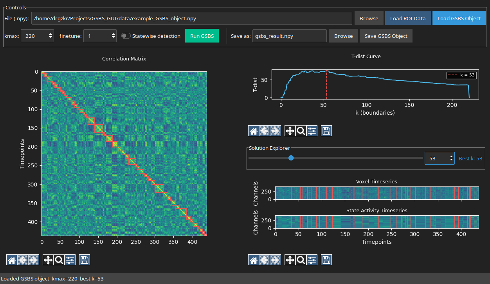

# GSBS GUI

An interactive GUI for running and exploring results of the
[Greedy State Boundary Search (GSBS)](https://github.com/lgeerligs/statesegmentation)
algorithm, which segments fMRI timeseries data into discrete neural states.



---

## Requirements

- Python 3.10+
- PyQt6

---

## Installation

### 1. Clone

```bash
git clone https://github.com/drgzkr/GSBS_GUI.git
cd GSBS_GUI
```

### 2. Create a virtual environment

```bash
python3 -m venv .venv
```

Activate it:

| Platform | Command |
|----------|---------|
| Linux / macOS | `source .venv/bin/activate` |
| Windows PowerShell | `.venv\Scripts\Activate.ps1` |
| Windows cmd.exe | `.venv\Scripts\activate.bat` |

### 3. Install dependencies

```bash
pip install -r requirements.txt
```

---

## Usage

### Main GUI

```bash
python gsbs_gui.py
# or pass a file directly
python gsbs_gui.py data/example_GSBS_object.npy
```

### Workflow

1. **Browse** to a `.npy` file — either raw ROI data `(n_timepoints, n_channels)` or a
   saved GSBS object. Click **Load File**; the type is detected automatically.
2. Set **kmax**, **finetune**, and the **Statewise detection** toggle.
3. Click **Run GSBS** — runs in a background thread; the UI stays responsive.
4. When done, drag the **k slider** to explore all solutions from k=1 to kmax:
   - T-dist curve with the selected k marked
   - Correlation matrix with state boundary boxes overlaid
   - Raw voxel timeseries with boundary lines
   - State-averaged timeseries with boundary lines
5. Click **Save GSBS Object** to persist the fitted result.

### Input data format

```python
import numpy as np
# shape: (timepoints, channels/voxels)
data = np.load("my_roi_data.npy")   # must be 2D
```

---

## Stimulus Boundary Viewer

`gsbs_stimuli_viewer.py` is a companion popup for inspecting stimulus images
at each state boundary. It expects a folder of images — one image per timepoint,
sorted by filename.

```bash
# standalone — opens folder picker, then shows demo boundaries
python gsbs_stimuli_viewer.py /path/to/stimuli_folder

# with a GSBS object (uses best k automatically)
python gsbs_stimuli_viewer.py /path/to/stimuli_folder data/example_GSBS_object.npy

# with explicit k
python gsbs_stimuli_viewer.py /path/to/stimuli_folder data/example_GSBS_object.npy 5
```

The viewer shows a scrollable strip of thumbnails centred on each boundary frame
(highlighted in red), with a slider to navigate between boundaries and a
**Context frames** spinbox to control how many frames before/after to display.

It can also be imported and embedded:

```python
from gsbs_stimuli_viewer import StimuliViewer, load_stim_paths

stim_paths = load_stim_paths("/path/to/stimuli_folder")
boundaries = [47, 112, 203]   # timepoint indices
dlg = StimuliViewer(boundaries, stim_paths, parent=self)
dlg.exec()
```

---

## Development

### Install dev dependencies

```bash
pip install -r requirements-dev.txt
```

### Run tests

```bash
pytest tests/
```

Tests are fully headless — no display server or `xvfb` needed.
`conftest.py` patches `tkinter` and `matplotlib`'s TkAgg backend at the
`sys.modules` level before any test module is collected.

#### With coverage report

```bash
pytest tests/ --cov=gsbs_gui --cov-report=term-missing
```

### Project layout

```
gsbs_gui.py                  main PyQt6 application (GridSpec layout)
gsbs_stimuli_viewer.py       standalone stimulus boundary viewer popup
requirements.txt             runtime dependencies
requirements-dev.txt         development / test dependencies
assets/
    screenshot.png           GUI screenshot
data/
    example_roi_data.npy           synthetic 2D fMRI-like array (438×401)
    example_GSBS_object.npy        pre-fitted GSBS result
legacy/
    gsbs_gui_splitter.py     earlier Qt splitter-based layout (archived)
    gsbs_gui_tkinter.py      classic tkinter/ttk version (archived)
    gsbs_gui_ttkbootstrap.py ttkbootstrap dark-theme version (archived)
tests/
    conftest.py              headless mock setup (runs before collection)
    fixtures.py              shared fixtures and fake GSBS object factory
    test_state_timeseries.py _state_timeseries numpy logic
    test_validation.py       load_roi_data / load_gsbs_object validation
    test_gsbs_done.py        _gsbs_done / _gsbs_error thread callbacks
    test_slider.py           slider state and _on_slider callback
```

---

## Known limitations / TODO

- Stimuli viewer not yet wired into the main GUI toolbar (run standalone for now).
- macOS figure DPI scaling not specifically handled.
